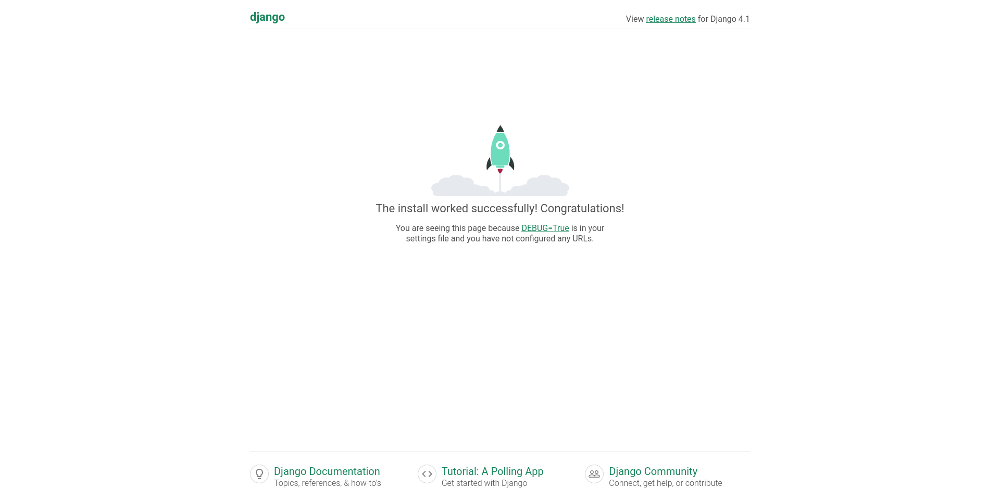

# Django Installation

## Install Django

1. Activate your environment and `pip install django`
2. Create django projects with `django-admin startproject web`
3. Open directory that django create for you `cd web/`
4. Running django web using `python manage.py runserver`
5. Open Browser at `localhost:8000`

## Page Structure

Commnd `django-admin startproject web` create folder named `web`. And in that folder contain several default file, folder, and configuration.

```

manage.py           # For acces command while development
web/
    __init__.py
    asgi.py         # Asyncronous Server (Later will exaplain)
    wsgi.py         # Web Server (Later will explain)
    urls.py         # All url in applications
    settings.py     # All applications settings

```


## Simple Page

